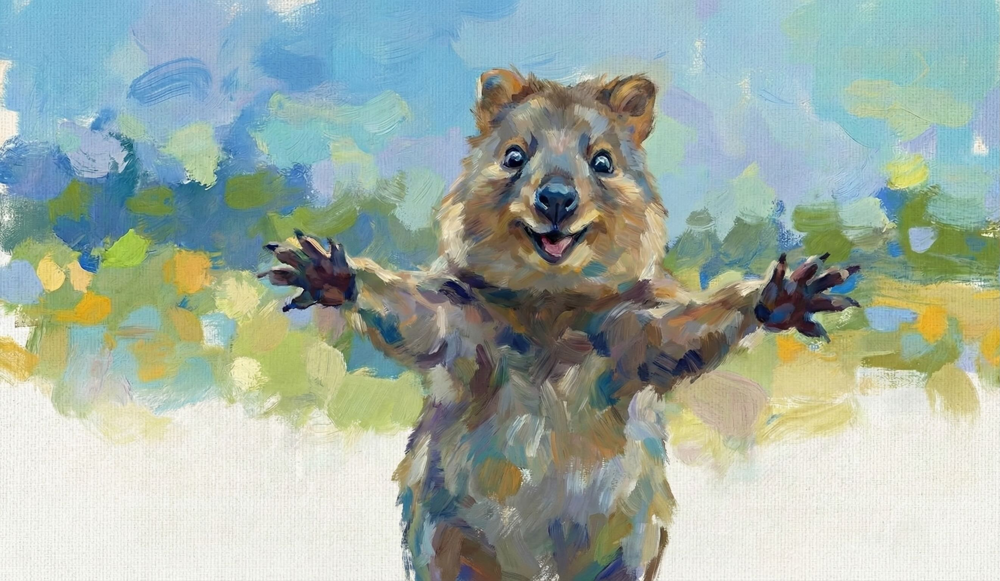

# COSC 481 Final Project



## Quick Start

### PIP

1. Run `pip install -r requirements.txt`
2. Run `python main.py`

### UV

1. Install [uv](https://docs.astral.sh/uv/getting-started/installation/)
2. Run `uv sync`
3. Run `uv run main.py`

## Structure

```
├── README.md
├── config.py
├── main.py
├── pyproject.toml
├── roadmap.md # development log
├── specification.pdf
└── uv.lock
```

## Citation