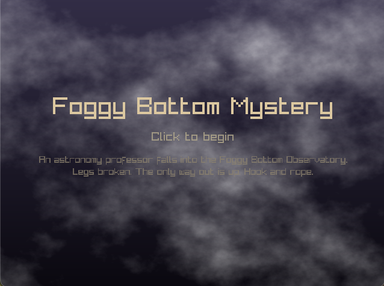
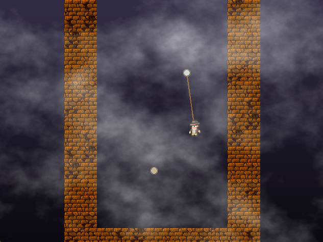

# Roadmap.md

### Date: 04/19 7:30 AM - 4:40 PM

**Goal**

- Implement look & feel + Level 1 (V1 code commit)

**Implementation**

- Downloaded image & sound assets
- Edited rope sound effect w/ Davinci Resolve (1 min sound effect ==> ~ 7 seconds)
- Implemented hook & swing physics
- Used sprites & textures
- Implemented lerp camera
- Implemented start screen, pause (P), debug (F3)
- Implemented Level 1
- Edited images with DaVinci Resolve Photo

*Technical Plan/Credit*:

- [DaVinci Resolve](https://www.blackmagicdesign.com/products/davinciresolve) — audio editing, image editing

*Content Credit*:

- [Swinging Physics for Player Movement](https://code.tutsplus.com/swinging-physics-for-player-movement-as-seen-in-spider-man-2-and-energy-hook--gamedev-8782t)
- [Elthen's 2D Pixel Art Archaeologist Sprites](https://elthen.itch.io/2d-pixel-art-archaeologist) - character sprite
- [OpenGameArt](https://opengameart.org/) - brick tiles, fog
- [Freesound](https://freesound.org/) - SFX
- [Maple Story](https://maplestory.nexon.com/Media/Music#a) - BGM

**Commit message**

- `feat(UI & L1): Code Commit V1`

**Next/TO DO :**

- Tune hook feel (gravity, swing force, damping)
- Level 2
- Ending sequence

---

### Date: 04/17 3:00 PM - 10:30 AM

**Goal**

- Polish the GDD narrative
- Find free digital assets (sprites, tile, fog, SFX, music)

**Implementation**

- Rewrote game summary pitch and player experience sections
- Researched and recoorded possible assets for character, background tile, fog effects, hook/rope sprites, sound effects, and background music
- Added asset & audio tables to GDD with sources and licenses

*Technical Plan/Credit*:

- N/A (documentation & asset research)

*Content Credit*: 

- [Elthen's 2D Pixel Art Archaeologist Sprites](https://elthen.itch.io/2d-pixel-art-archaeologist) - character sprite
- [OpenGameArt](https://opengameart.org/) - sprites, tile, fog
- [Freesound](https://freesound.org/) - SFX (grapple, clank, whoosh, rope tension, body fall)
- [Maple Story](https://maplestory.nexon.com/Media/Music#a) - BGM

**Commit message**

- `doc(GDD): polished narrative, added asset & audio references`

**Next/TO DO :**

- Download and test the asset candidates
- Implement character & rope mechanics
- Start building the first vertical level

---

### Date: 04/15 12:45 PM - 2:35 PM

**Goal**

- Finish the narrative
  
**Implementation**

- Game pitch, background story, 

*Technical Plan/Credit*:

- N/A(documentation)

*Content Credit*: 

- [Foggy Bottom Observatory](https://observatory.colgate.edu/foggybot/foggybot.html)

**Commit message**

- `doc: finished GDD`

**Next/TO DO :**

- Find character sprite & digital assets that match the theme of the game
- Implement character & rope mechenics.
- Polish the writing

---

### Date: 04/13 11:20 PM - 4/14 1:00 AM

**Goal**

- Narrative Ideation
    - Come up with inspirations
- Mechanics Ideation
- Title Ideation
- Add GDD Boilerplate 

**Implementation**

*Technical Plan/Credit*:

- Convert GDD Google doc to .md file
- Research games that I've enjoyed

*Content Credit*: 

- [Owl Chemist GDD](https://docs.google.com/document/d/1_iPOdIFm9iiRNyMTM2WL3YTD0CGeOks3YKBjTsDJvd8/edit?tab=t.0#heading=h.k2hqrk99qjg6)
- [Professor Layton Game Series](https://en.wikipedia.org/wiki/Professor_Layton)
- [Professor Layton Soundtrack](https://www.youtube.com/watch?v=8PydbXdAx84&list=RD8PydbXdAx84&start_radio=1)
- [Getting Over It with Bennett Foddy](https://en.wikipedia.org/wiki/Getting_Over_It_with_Bennett_Foddy)

**Commit message**

- `doc: add GDD boilerplate`

**Next/TO DO :**

- Finish GDD
- Find character sprite

---

### Date: 04/08/2026 12:50 PM

**Goal**

- Change cross collect to use a coin texture using `draw_texture_pro()`
- Animate Coin
- Add screen recordign (`left ctl + r`)

**Implementation**

*Technical Plan/Credit*:

- Use Lab 4 code

*Content Credit*: 

- [Web Coin File](https://opengameart.org/content/coin-animation)

**Commit message**

- `chore: add python env`
- `doc: add specification and templates`
- `doc(roadmap): updated for 04/08/2026`
- `build(raylib): removed pyray, added raylib`
- `chore: added python code tempalte`
- `doc(readme): added quick start and structure sections`
- `doc: added greeting image`
- `chore(git): ignores mac related files`
- `build(pip): added pip install`
- `feat(collect): add coin texture to draw_coins`
- `feat: animated coin`
- `build: add imageio lib`
- `feat: screen recording(left crl + r)`

**Next/TO DO :**

- fix coin sprite alignment
- class Coin/Coins

---